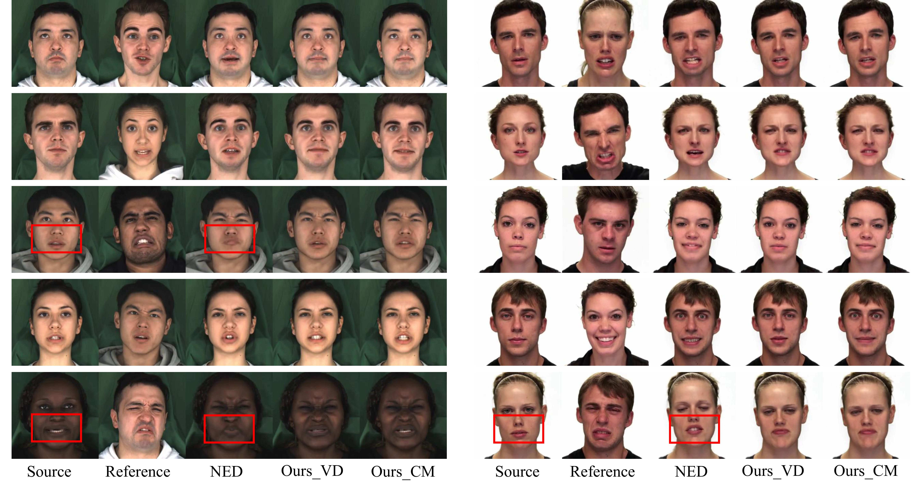
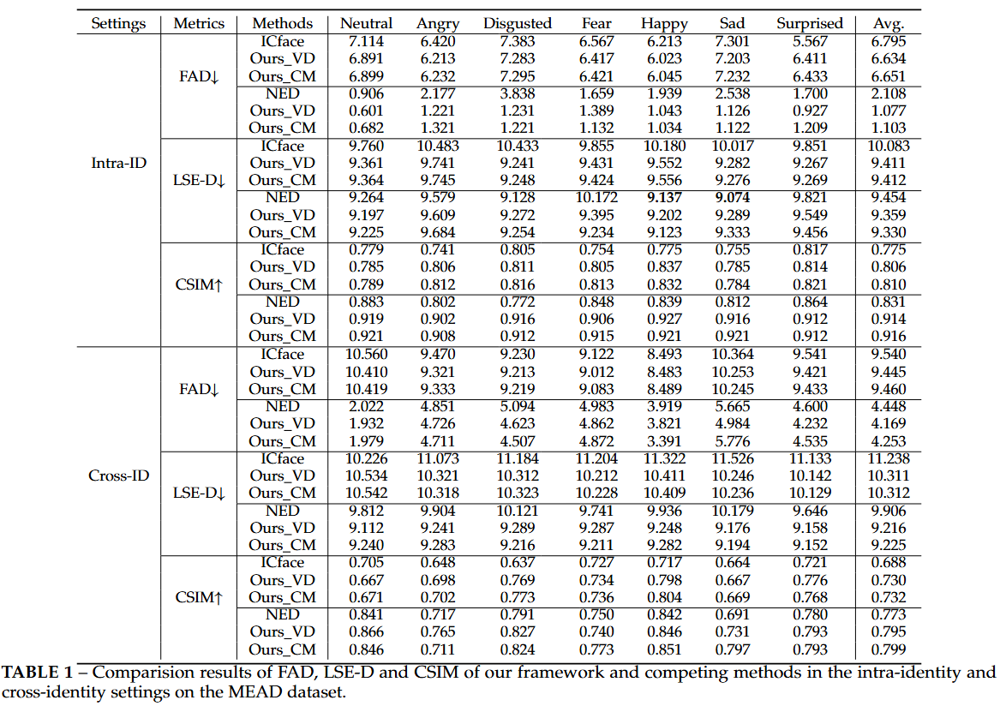
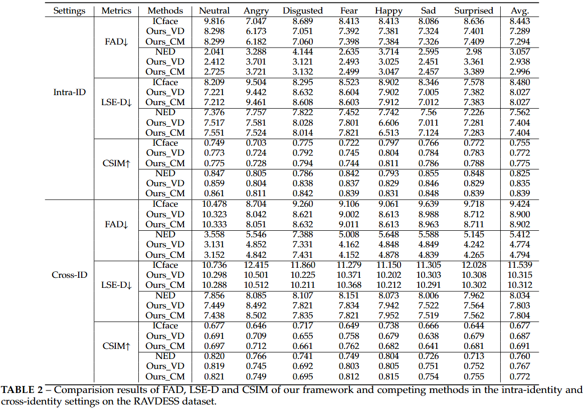

# Learning Spatial-Temporal Coherent Correlationsfor Speech-Preserving Facial Expression Manipulation
## abstract
Speech-preserving facial expression manipulation (SPFEM) aims to modify facial emotions while meticulously maintaining the mouth animation associated with spoken content. Current works depend on inaccessible paired training samples for the person, where two aligned frames exhibit the same speech content yet differ in emotional expression, limiting the SPFEM applications in real-world scenarios. In this work, we discover that speakers who convey the same content with different emotions exhibit highly correlated local facial animations in both spatial and temporal spaces, providing valuable supervision for SPFEM. To capitalize on this insight, we propose a novel spatial-tempral coherent correlation learning (STCCL) algorithm, which models the aforementioned correlations as explicit metrics and integrates the metrics to supervise manipulating facial expression and meanwhile better preserving the facial animation of spoken contents. To this end, it first learns a spatial coherent correlation metric, ensuring that the visual correlations of adjacent local regions within an image linked to a specific emotion closely resemble those of corresponding regions in an image linked to a different emotion. Simultaneously, it develops a temporal coherent correlation metric, ensuring that the visual correlations of specific regions across adjacent image frames associated with one emotion are similar to those in the corresponding regions of frames associated with another emotion. Recognizing that visual correlations are not uniform across all regions, we have also crafted a correlation-aware adaptive strategy that prioritizes regions that present greater challenges. During SPFEM model training, we construct the spatial-temporal coherent correlation metric between corresponding local regions of the input and output image frames as addition loss to supervise the generation process. We conduct extensive experiments on variant datasets, and the results demonstrate the effectiveness of the proposed STCCL algorithm.

Here are some visual results of our approach:

Here are the quantitative results of integrating STCCL into other methods.

